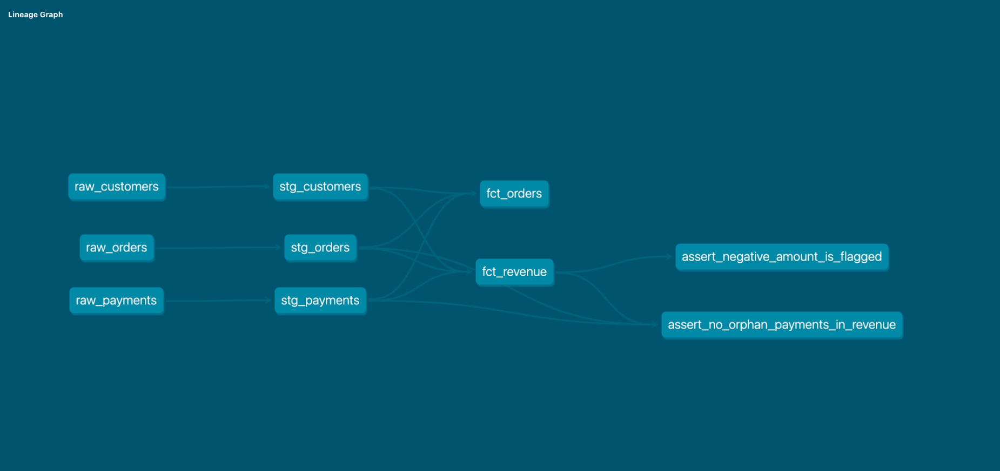

# E-commerce Data Quality Pipeline

Un progetto di analytics engineering che trasforma dati e-commerce grezzi e volutamente imperfetti — clienti duplicati, ordini orfani, importi mancanti o negativi — in modelli di ricavi affidabili, testati e tracciabili. Costruito con **dbt** su **Google BigQuery**, seguendo il paradigma ELT: carica prima, trasforma dopo, dentro il warehouse.

Non è un tutorial ripulito. I dati grezzi contengono problemi reali di qualità inseriti di proposito, e il progetto esiste per dimostrare come si gestiscono — non nascondendoli, ma decidendo consapevolmente dove e come trattarli lungo la pipeline.

---

## Perché questo progetto

Qualsiasi azienda con più di una sorgente dati (un CRM, un sistema ordini, un gateway di pagamento) si scontra prima o poi con lo stesso problema: i numeri non tornano, e nessuno sa dire con certezza perché. Un cliente compare due volte. Un ordine punta a un pagamento che non esiste più. Un importo è negativo e nessuno ricorda se è un rimborso o un errore di sistema.

Questo progetto simula esattamente quello scenario e costruisce la disciplina per risolverlo: uno strato che pulisce solo il formato senza mai nascondere un problema, e uno strato successivo che prende le decisioni di business — dichiarandole sempre esplicitamente, mai in silenzio.

**dbt è lo strumento che rende possibile questa disciplina.** Non sposta dati (quello lo fanno strumenti come Fivetran o Airbyte), non pianifica quando far girare la pipeline (quello lo fa un orchestratore come Airflow o, in scala ridotta, GitHub Actions). dbt fa una cosa sola e la fa bene: trasforma i dati dentro il warehouse con SQL versionato, testato e documentato — portando dentro l'analytics le stesse pratiche che l'ingegneria del software usa da decenni. Ogni modello è una query dichiarata, non uno script eseguito a mano. Ogni dipendenza tra modelli è esplicita e verificata automaticamente. Ogni regola di qualità è un test che gira ad ogni esecuzione, non un controllo fatto una volta e dimenticato.

---

## Architettura

Il progetto segue la **medallion architecture**: tre livelli di qualità crescente, dal dato grezzo al dato pronto per il business.

```
raw_customers ─┐
raw_orders ────┼──▶ staging (pulizia formato) ──▶ marts (logica di business) ──▶ test
raw_payments ──┘
```



**Raw** — i tre CSV sorgente (`raw_customers`, `raw_orders`, `raw_payments`), caricati as-is con `dbt seed`. Non vengono mai toccati: sono la fonte di verità immutabile a cui tornare se qualcosa a valle va storto.

**Staging** (`stg_customers`, `stg_orders`, `stg_payments`) — un modello per ogni sorgente, pulizia di solo formato: spazi, casistica, tipi di dato, codici paese standardizzati. Regola ferrea: lo staging non filtra mai righe e non prende mai decisioni di business. Un valore mancante diventa un `NULL` esplicito, non sparisce. Se un dato è sporco, lo staging lo lascia visibile — segnala, non decide.

**Marts** (`fct_orders`, `fct_revenue`) — qui vengono prese le decisioni vere, e ognuna è dichiarata nel codice, non nascosta in una correzione silenziosa.

---

## Le decisioni di design — e perché contano più del codice

La parte tecnicamente più interessante di questo progetto non sono le query in sé, ma le scelte fatte su come trattare dati imperfetti. Sono elencate qui perché rappresentano il vero lavoro di analytics engineering: decidere cosa fare quando i dati non sono quelli del libro di testo.

**Clienti e ordini duplicati → deduplicati.** Un errore di sistema può produrre lo stesso record due volte. Qui non c'è ambiguità: viene tenuta una sola versione, con `ROW_NUMBER()` su una regola di ordinamento esplicita.

**Ordini con cliente non riconosciuto → mantenuti, mai eliminati.** Se un ordine punta a un `customer_id` che non esiste in anagrafica, è quasi certamente un sintomo di un problema a monte — una sincronizzazione rotta, un cliente cancellato per errore. Cancellare quell'ordine farebbe sparire il sintomo insieme al problema. Viene invece mantenuto e marcato con un flag (`customer_status = 'unknown'`), visibile a chiunque analizzi i dati dopo di me.

**Pagamenti orfani (order_id inesistente) → esclusi dai ricavi, ma non invisibili.** Un pagamento senza un ordine valido a cui essere associato non può essere sommato ai ricavi — non si sa a cosa appartenga. Viene escluso da `fct_revenue`, ma resta interrogabile in `stg_payments` per chiunque voglia indagare l'anomalia a monte.

**Importi mancanti → imputati con la mediana, ma mai in silenzio.** Quando un pagamento risulta senza importo, la pipeline stima un valore con la mediana globale — una scelta statistica ragionevole per non perdere la riga dall'analisi. Ma il valore stimato vive in una colonna separata (`total_amount_imputed`), distinta dall'importo osservato (`total_amount`). Chi guarda i dati sa sempre distinguere cosa è stato misurato da cosa è stato stimato.

**Importi negativi → mai corretti nel segno, sempre flaggati.** Questa è la decisione più delicata del progetto. Un importo negativo in una tabella pagamenti è più spesso un rimborso legittimo che un errore di battitura — e capire quale delle due cose sia richiede contesto che la pipeline non ha. Correggerlo automaticamente in positivo trasformerebbe silenziosamente un rimborso in un ricavo, cambiando il significato economico del dato senza che nessuno se ne accorga. La pipeline non decide al posto di chi analizza: lascia il segno originale e aggiunge un flag (`has_negative_amount`) che rende il caso visibile e verificabile.

Il principio comune a tutte queste scelte: **ogni modifica ai dati deve essere tracciabile da chi la guarda dopo.** Nessuna correzione silenziosa, nessun valore "aggiustato" che sostituisce quello osservato senza lasciare traccia.

---

## Qualità dei dati: i test

17 test automatici, distribuiti su due livelli, verificano che la pipeline si comporti come dichiarato — non una volta, ma ad ogni singola esecuzione.

**Generic test** (dbt nativi): `unique` e `not_null` sulle chiavi primarie, `relationships` per l'integrità referenziale tra ordini/clienti e pagamenti/ordini, `accepted_values` sui campi standardizzati come paese e stato ordine.

**Singular test** (query scritte su misura per le regole di business di questo progetto):
- `assert_no_orphan_payments_in_revenue` — verifica che nessun pagamento orfano sia finito, per errore, dentro il calcolo dei ricavi
- `assert_negative_amount_is_flagged` — verifica che ogni importo negativo abbia sempre il flag corrispondente attivo, garantendo che il segnale e il dato non si contraddicano mai

Un test che fallisce su un dato sporco reale non è un bug della pipeline: è la prova che il sistema di controllo funziona. La distinzione tra "test rotto" e "test che ha trovato un problema vero" è il punto centrale di tutto il progetto.

---

## Stack

- **dbt Core** — trasformazione, testing, documentazione, gestione delle dipendenze (DAG)
- **Google BigQuery** — data warehouse, region EU
- **Python 3.12** — ambiente di sviluppo (venv)
- **Git / GitHub** — versionamento

---

## Come farlo girare

```bash
# ambiente
python3.12 -m venv dbt-env
source dbt-env/bin/activate
pip install dbt-bigquery

# autenticazione (richiede un progetto GCP con BigQuery attivo)
gcloud auth application-default login

# pipeline completa: carica i dati grezzi, costruisce staging e marts, esegue tutti i test
dbt seed
dbt run
dbt test

# documentazione e lineage graph interattivo
dbt docs generate
dbt docs serve
```

---

## Struttura del progetto

```
models/
├── staging/          # pulizia formato — un modello per sorgente
│   ├── stg_customers.sql
│   ├── stg_orders.sql
│   ├── stg_payments.sql
│   └── staging.yml    # generic test
└── marts/            # logica di business — pronti per l'analisi
    ├── fct_orders.sql
    ├── fct_revenue.sql
    └── marts.yml       # generic test
seeds/                 # dati grezzi di esempio (CSV)
tests/                  # singular test custom
```